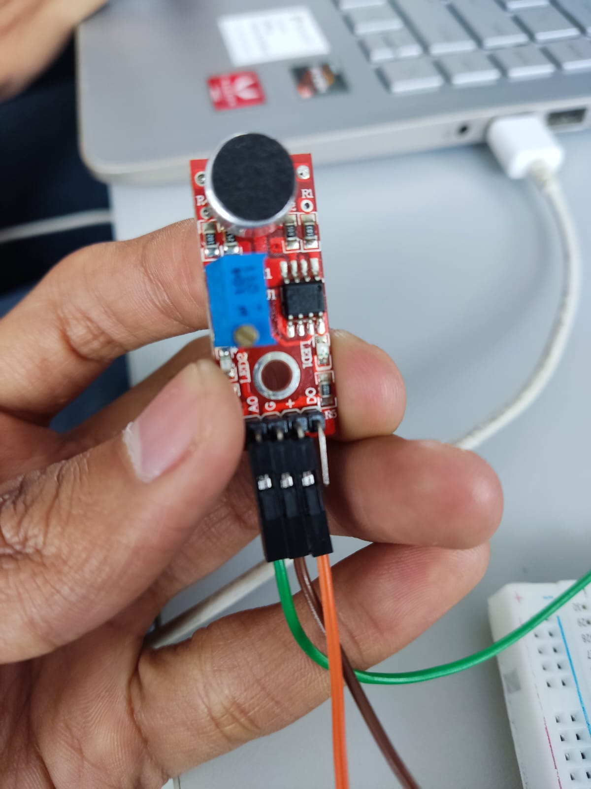
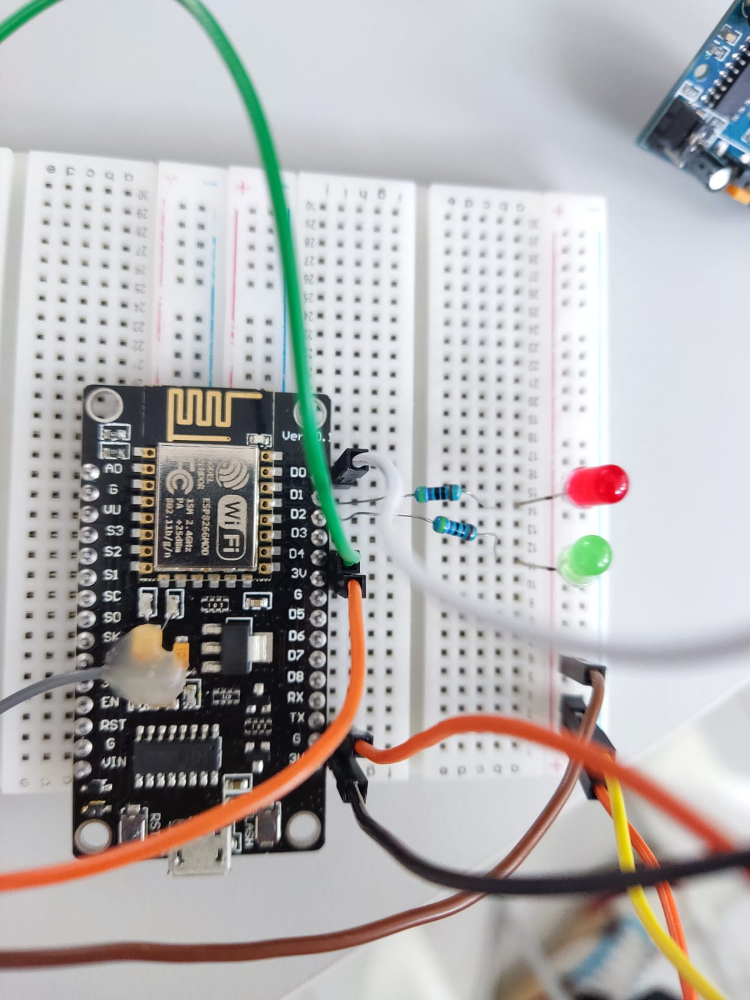
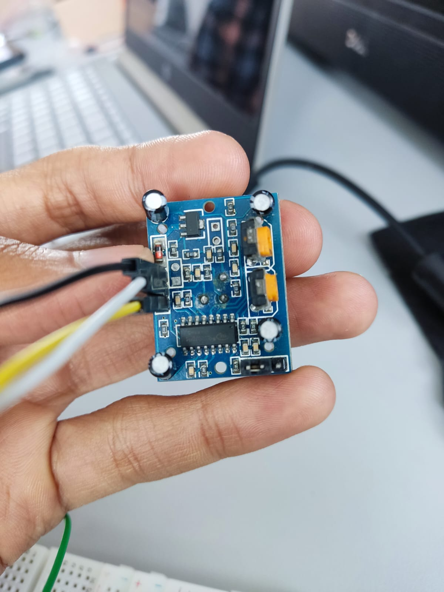
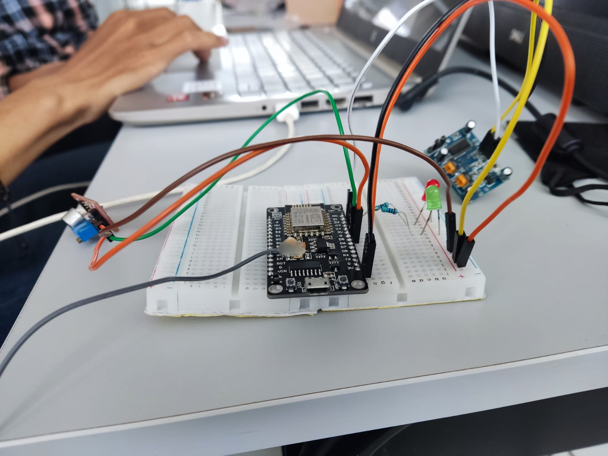

# posttest3-praktikum-iot-unmul

## Anggota Kelompok
Kelompok 7 A 2020:
1. 2009106007 Ahmad Nur Rifqi
2. 2009106008 Vigo Santri Ali
3. 2009106021 Aby Kurniawan

## Judul Studi Kasus
### Controlling & Monitoring lampu dan suara ribut menggunakan bot telegram

## Deskripsi
Membuat rangkaian menggunakan sensor suara untuk mendeteksi suara dan sensor pir untuk mendeteksi gerak dengan batas tertentu lampu led merah akan menyala jika dibawa batas lampu hijau akan menyala.

## Pembagian Tugas
1. Ahmad Nur Rifqi = Mengatur konfigurasi WEBSERVER dan mengatur konfigurasi enable\disable button dari LED dan Buzzer 
2. Vigo Santri Ali = Membuat Rangkaian Buzzer dan mengatur konfigurasi button untuk menambah dan mengurangi tone Buzzer
3. Aby Kurniawan = Membuat Rangkaian LED dan mengatur konfigurasi button untuk menambah dan mengurangi kecerahan LED

## Komponen Yang Digunakan
1. ESP8266
2. LED
3. Buzzer
4. Resistor
5. Push Button
6. Kabel Jumper
7. Bread Board
8. Kabel USB

## Board Schematic

## Link Video
<a href="https://drive.google.com/file/d/1ZfSmqUV5rtPVA_r8M9dv6_qLtPy5BjVF/view?usp=sharing">Kelompok 7 A 2020</a>
